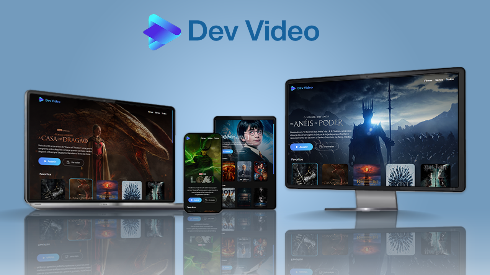

## 📝 Sobre

O projeto <b>Dev Video</b> trata-se de uma plataforma de streaming fictícia que apresenta filmes e séries distribuídos em carrosséis dinâmicos, possibilitando ver os detalhes de cada produção. O projeto foi desenvolvido tanto para desktops quanto para dispositivos móveis, contando com um design responsivo que se adapta a qualquer formato de tela.

## ⚙ Funcionalidades

Ao abrir o site, o primeiro item será exibido em detalhes: logo, descrição, poster, papel de parede e botões para assistir. O botão <i>Assistir</i> leva o usuário para a página oficial do filme ou série. Em <i>Ver trailer</i>, um player de vídeo é exbido na tela com uma prévia da produção. O botão <i>Voltar</i> retorna à página principal, onde quatro carrosséis distribuem os filmes e séries nas categorias "Favoritos" (filmes e séries que eu amo!), "Filmes" (apenas as produções cinematográficas), "Séries" (apenas produções de streaming e TV) e "Todos" (lista tudo).

## 🖥 Tecnologias

Este projeto foi desenvolvido com React.js e Vite, utilizando Styled Components para estilização.
